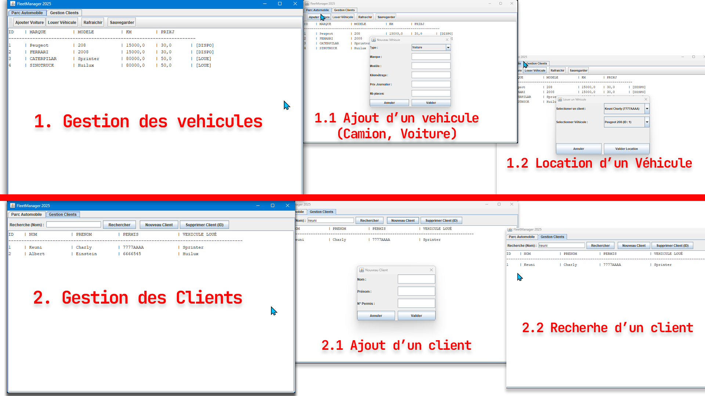

<div align="center">

# 🚗 RentManager

<p>
  <strong>La solution robuste de gestion de la Location automobile conçue avec une architecture Java modulaire.</strong>
</p>

<p>
  <a href="https://github.com/votre-username/fleet-manager/actions">
    
  </a>
  
  
  
  <a href="LICENSE">
    
  </a>
</p>

<h4>
  <a href="#-à-propos">À propos</a> •
  <a href="#-fonctionnalités-clés">Fonctionnalités</a> •
  <a href="#-stack-technique">Stack Technique</a> •
  <a href="#-architecture-du-projet">Architecture</a> •
  <a href="#-installation--démarrage">Installation</a> •
  <a href="#-roadmap">Roadmap</a>
</h4>

</div>

---

## 📖 À propos

**RentManager** n'est pas une simple application de gestion. C'est une démonstration technique d'une **architecture logicielle rigoureuse** appliquée à un cas métier concret : la location de véhicules.

Le projet remplace les processus manuels (Excel) par une solution **Orientée Objet** capable de gérer des règles métier complexes (polymorphisme des tarifs, vérification de disponibilité) et d'assurer la persistance des données.

Ce projet est egalement très essentiel pour moi, car il m'a permis de toucher à une biblothèque dite `Legacy` qu'est `Swing` c'est une decouverte que j'ai beaucoup apprécié.

> *Note : j'ai réalisé ce projet pour me preparer à une intérrogation de Java 😂😂.*

## 🎥 Démo Visuelle

> *Note : Capture d'écran de l'interface principale.*



## ✨ Fonctionnalités Clés

Ce projet implémente les piliers de la programmation orientée objet :

* 📦 **Gestion de Parc automobile :** Support du **polymorphisme** pour gérer différents types de véhicules (`Voiture`, `Camion`) avec des règles de tarification spécifiques.
* 👥 **CRM Clients Intégré :** Gestion complète (CRUD) des clients et historique des locations.
* 🔒 **Logique Métier :** Système de location avec gestion d'exceptions (`LocationException`) pour empêcher les conflits (double location, véhicule indisponible).
* 💾 **Persistance des Données :** Sauvegarde et chargement automatique de l'état du parc via un système de fichiers CSV (`parc.csv`).
* 🖥️ **Interface Graphique Swing :** UI complète avec onglets, formulaires modaux et tableaux de bord dynamiques.

## 🛠️ Stack Technique

| Composant | Technologie | Détails |
| :--- | :--- | :--- |
| **Langage** | Java | JDK 17+ (Utilisation des Streams) |
| **UI** | Swing | AWT/Swing  |
| **Architecture** | N-Tiers | Model, Service, UI, Exception |
| **Persistance** | File I/O | `BufferedWriter` / `BufferedReader` (CSV) |

## 🏗️ Architecture du Projet

La structure du code respecte la séparation des responsabilités pour garantir la maintenabilité :

```text
src/
├── exception/      # Gestion des erreurs (LocationException)
├── model/          # Entités (Vehicule, Voiture, Camion, Client)
├── service/        # Logique métier (Agence, Calculs, IO)
├── ui/             # Interface utilisateur (MainFrame, Dialogs)
└── Main.java       # Point d'entrée de l'application
```

## 🚀 Installation & Démarrage

### Prérequis
* **JDK 17** ou supérieur installé.
* Un IDE (IntelliJ IDEA, Eclipse) ou un terminal.

### Lancer le projet

1.  **Cloner le dépôt**
    ```bash
    git clone https://github.com/Charlyken/rent-manager.git
    cd rent-manager
    ```

2.  **Compiler et Exécuter**

    * **Via Terminal :**
        ```bash
        # Création du dossier bin
        mkdir bin
        
        # Compilation
        javac -d bin -sourcepath src src/Main.java
        
        # Exécution
        java -cp bin Main
        ```

    * **Via IDE :** Ouvrez le dossier comme projet, localisez `src/Main.java` et lancez la méthode `main`.

## 🗺️ Roadmap

Les futures évolutions prévues pour transformer ce MVP en produit complet :

- [ ] **Persistance SQL :** Remplacer le CSV par une base de données H2 ou MySQL (JDBC).
- [ ] **Build System :** Migration vers Maven pour la gestion des dépendances.

## 🤝 Contribuer

Les contributions sont les bienvenues ! Veuillez consulter le fichier `CONTRIBUTING.md` (à venir) pour les détails.

1.  **Forkez** le projet
2.  Créez votre branche (`git checkout -b feature/AmazingFeature`)
3.  Committez vos changements (`git commit -m 'Add some AmazingFeature'`)
4.  Pushez vers la branche (`git push origin feature/AmazingFeature`)
5.  Ouvrez une **Pull Request**

## 📄 Licence

Distribué sous la licence **MIT**. Voir le fichier `LICENSE` pour plus d'informations.

---

<div align="center">
  <i>Développé par Charly Keuni.</i>
</div>
